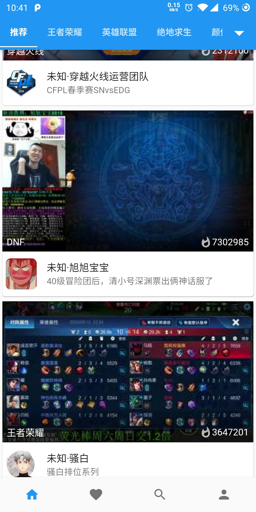

# alltv
获取 斗鱼、虎牙、bilibili、企鹅电竞直播源、弹幕信息
#### app项目地址：[alltv_flutter](https://github.com/ha2ryzhang/alltv_flutter)
#### 预览地址：[在线api文档](http://debugers.com:8888/swagger-ui.html)
#### apk下载地址: [蓝奏云](https://alltv.lanzous.com/b01bexnha)
**基于flutter 开发 理论支持ios和android 但目前就build了安卓的，没有ios真机测试。**
#### 弹幕预览请移步下面
整合了 swagger2 本地运行访问 http://localhost:8888/swagger-ui.html 即可查看api文档

#### 很不幸 触手没了(停服)

#### New Feature
* 2021.01.26： 将爬虫整合到一起 spring task 管理 依赖 redis 
* 2020.06.10： 增加搜索功能
* 2020.06.02： 修复虎牙直播
* 已经开始 app开发了 采用 flutter 所以兼容 android 和 ios 
* 新增企鹅电竞
* 新增获取bilibili直播间弹幕(websocket 具体食用方法在下面)

#### [bilibili弹幕食用方法](bilibiliDanmaku.md)

#### docker (已更新)

1. 将[application.yaml模板复制到配置目录](application-tmp.yaml)
```bash
mkdir ~/.alltv
cd ~/.alltv
//需要配置application.yaml
//这里将配置文件复制过来就好 docker 映射的目录在 ~/.alltv 自行修改redis 配置
```
```bash
docker pull harryzhang6/alltv

//这里redis也使用docker
docker run -itd --name redis -p 6060:6379 redis
docker run --rm -it -d --net host --name alltv -p 8888:8888 -v ~/.alltv:/root/.alltv  harryzhang6/alltv
```
#### 后续开发:

- [x] 修复 BILIBILI 直播源获取

- [x] 提供线上api预览

- [x] 加入其他平台，如触手、企鹅电竞

- [x] 增加app 可视化

- [ ] 增加其他平台获取弹幕(websocket)
- [ ] 增加影视 和 卫视直播 


### AllTV app 别忘了点star哦

